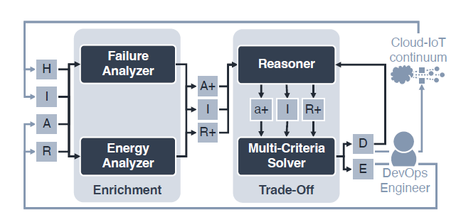

# Green-aware Constraint Generator

This component develops techniques to classify the profile of nodes in a Cloud-IoT infrastructure and correspondingly generate requirements to reduce the energy consumed by MSAs deployed on such infrastructure. In addition, the relationship between an MSA components, based on the connections/functional dependencies between microservices and the information on the data they exchange, are considered in the analysis to provide information about microservice coplacement to the solver.



## Folders

- Components: Logical units in charge of different tasks inside the tool
- Input Files: Contains the inputs files needed for this tool
- Output Files: Contains the outputs generated from this tool
- Images: Graphical assets used for this readme.

## Terminology

- Infrastructure: The organizational structure of the nodes, includes information like the topology and the resources of each node.
- Node: The physical entity where we deploy one or more of our services.
- Service: Fundamental entity that offers a functionality. When talking about services we will be referring to a microservice deployed on a node.
- Flavour: The typology of a service. Can range from small to large. A small service will use less resources than its large counterpart.
- Energy mix: Combination of different energy resources to meet the energy needs of a node. The mix includes renewable and non renewable resources.
- Deployment: Includes the information about the disposition of each service in which flavour on which node.

# Installation

```bash
python -m venv .venv
source ./.venv/bin/activate # or equivalent in other OS
pip install -r requirements.txt
```
# Utilisation
```bash
python .\EnergyAnalyzer [--region {eu,us}] [--keep]
```
> Optional: --region {eu,us} / -r 
- Indicates the geographical region used for the infrastructure and the deployment.
- Defaults to eu

> Optional: --keep / -k:
- Indicates whether to keep or not the knowledge base. The knowledge base should be cleared when changing infrastructure.
Defaults to not keeping

# Components


## Energy Estimator

Starting from Monitoring Metrics generates the consumption of each service and connection

## Contrainst Generator

Generates the constraints that will be provided as output, starting from the consumptions

## Energy Mix Gatherer

Supporting module that provides the energy mix of the nodes

## Knowledge Base

Holds useful information gathered from previous iterations

## Knowledge Base Enricher

Updates the memory of the current knowledge base and enriches the current constraints with relevant past ones

## Constraints Ranker

Creates an internal ranking of constraints based on the amount of energy consumption they help decrease

## Constraint Adapter

Formats the output for the consumption of future components

## Explainability Generator

Component responsible for generating the Explanability Report, giving an human readable explanation for the constraints generated